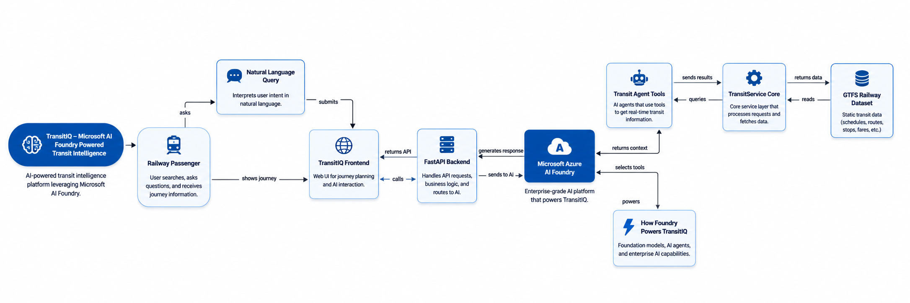
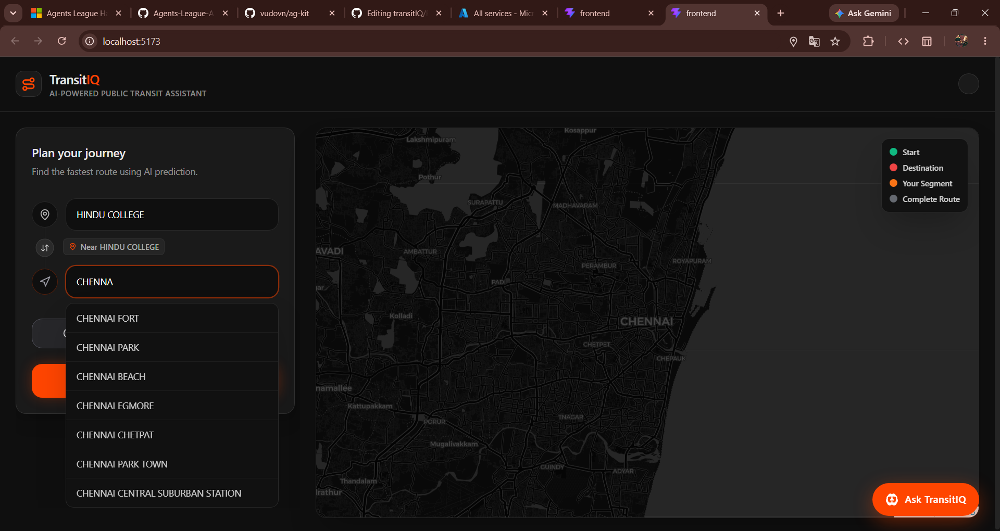
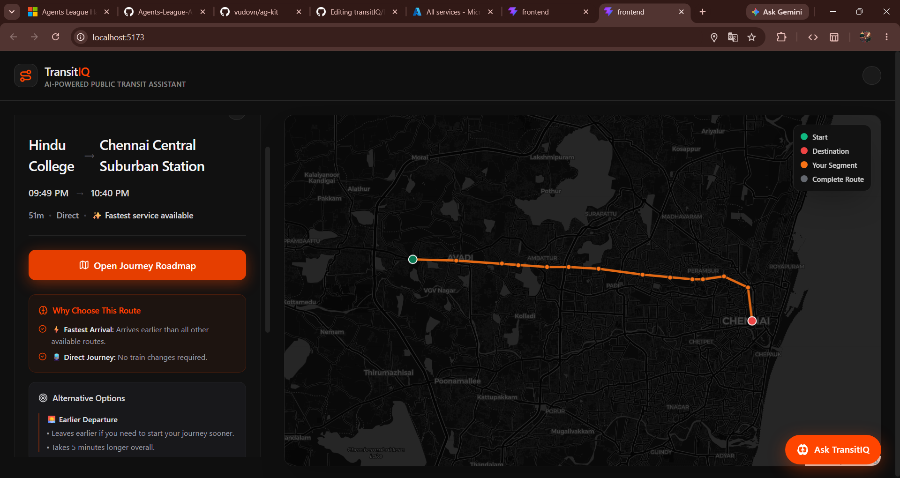
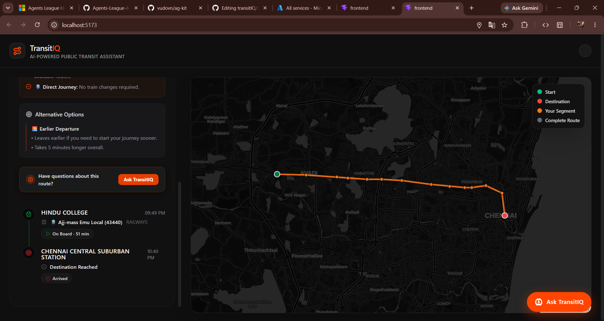
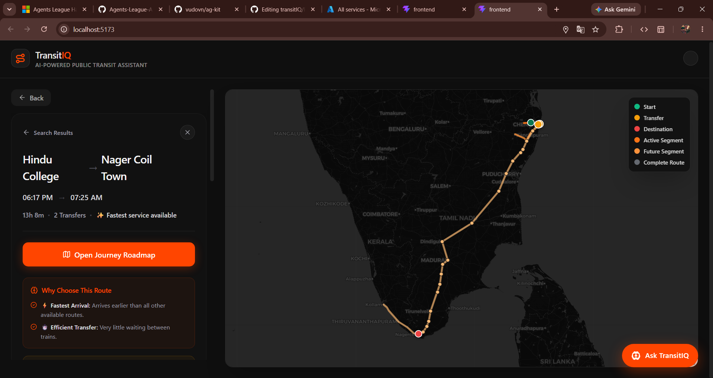
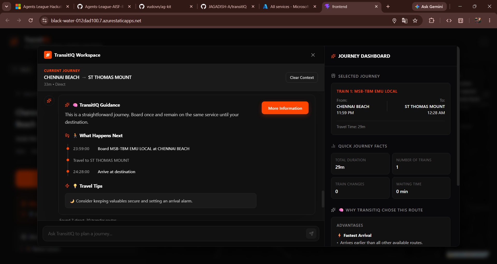
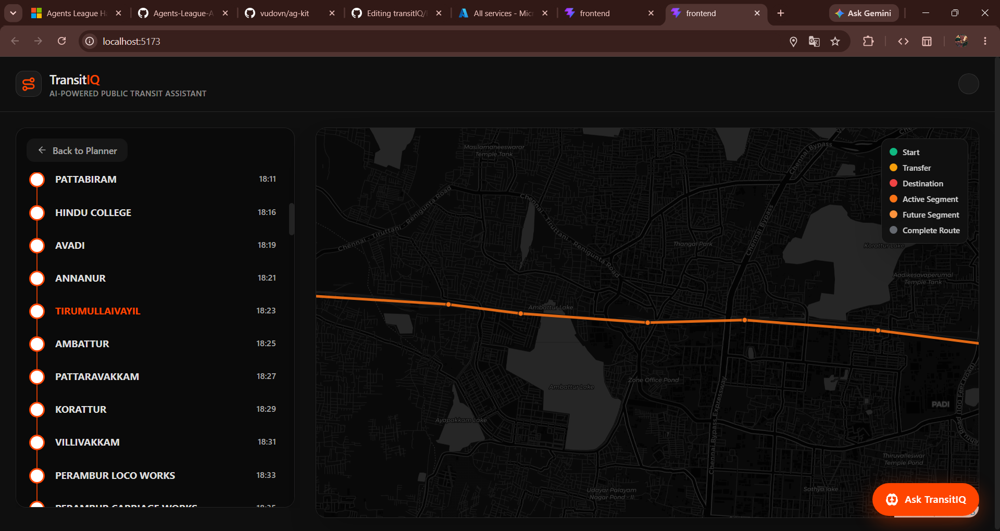

# 🚆 TransitIQ

<p align="center">
  
  
  
  
  
  
</p>

<p align="center">
  <strong>An AI-powered railway route planning platform built for intelligent journey discovery and optimal transit scheduling.</strong>
</p>

---

## 🧐 The Problem & Our Solution

### The Problem
Traditional railway and transit mapping applications are rigid, database-lookup tools. They only retrieve direct schedules and leave it entirely up to the commuter to figure out complex multi-transfer routes, connection timings, and alternative itineraries. There is a total lack of personalized guidance, making trip discovery a stressful experience for daily commuters and travelers alike.

### The Solution
**TransitIQ** bridges the gap between raw transit schedules and natural human query logic. By leveraging **General Transit Feed Specification (GTFS)** data, advanced multi-transfer routing algorithms, and **Microsoft Azure AI**, TransitIQ provides a conversational travel experience. It automatically computes optimal 1-transfer and 2-transfer itineraries and generates real-time, context-aware journey guidance.

---

## ✨ Key Features

* 🤖 **AI Journey Assistant:** Real-time conversational recommendations, natural language trip summaries, and context-aware connection assistance powered by Azure OpenAI.
* 🛤️ **Smart Multi-Transfer Routing:** Instantly discover the best way to travel between any two stations with custom-developed 1-transfer and 2-transfer routing algorithms.
* 🗺️ **Interactive Journey Maps:** Dynamic visual layouts displaying route pathways, stop locations, and connection nodes using React-Leaflet.
* ⏱️ **Station-by-Station Roadmap:** A detailed, step-by-step timeline of the journey detailing precise departure times, arrival times, transit layovers, and platform wait times.
* 🚀 **High-Performance GTFS Engine:** Efficient, highly indexed processing of massive spatial and relational timetable datasets.

---

## 🏛️ System Architecture

TransitIQ is built on a clean, decoupled client-server architecture designed for reliability, speed, and cloud scaling. 

<p align="center">
  
</p>

### Architecture Workflow
1. **Presentation Layer:** A responsive React and TypeScript frontend, rendering interactive transit nodes using Leaflet maps.
2. **Application Layer:** A lightweight Python Flask API handling query validation, CORS security, and user session payloads.
3. **Data & Routing Engine:** Localized GTFS parser and spatial database index resolving schedule nodes and complex paths.
4. **Intelligence Layer:** Integration with Azure OpenAI services that compile complex timetable nodes into conversational, easy-to-read trip itineraries.

---

## 🛠️ Technology Stack

| Layer | Technologies | Key Libraries & Services |
| :--- | :--- | :--- |
| **Frontend** | React (v18+), TypeScript, Vite, CSS3 | React-Leaflet, Lucide Icons, Fetch API |
| **Backend** | Python (v3.9+), Flask | Uvicorn, Gunicorn, CORS |
| **Data Engine** | GTFS Feeds, SQLite / Pandas | Custom GTFS Parsing scripts |
| **Cloud & AI** | Microsoft Azure | Azure OpenAI, App Service, Static Web Apps |

---

## 📸 Screenshots

To view the complete visual setup of TransitIQ, see the interface showcase below:

#### 🏠 Home Page & Search Interface
<p align="center">
  
</p>

#### 🛤️ Intelligent Route Search & Options
<p align="center">
  
</p>

<p align="center">
  
</p>


#### 🗺️ Interactive Maps & Trip Navigation
<p align="center">
  
</p>

<p align="center">
  
</p>

#### 🤖 AI Journey Assistant & Travel Assistant Chat
<p align="center">
  
</p>

#### ⏱️ Step-by-Step Timelines & Layovers
<p align="center">
  
</p>

---

## ⚙️ Installation & Setup

### Prerequisites
* **Node.js** (v18.0 or higher)
* **Python** (v3.9 or higher)
* **Azure Subscription** (with access to Azure OpenAI Service)

### 1. Clone the Repository
```bash
git clone https://github.com/yourusername/TransitIQ.git
cd TransitIQ
```

### 2. Backend Setup
1. Navigate to the backend directory and create a virtual environment:
   ```bash
   cd backend
   python -m venv venv
   ```
2. Activate the virtual environment:
   * **Windows (PowerShell):**
     ```powershell
     .\venv\Scripts\Activate.ps1
     ```
   * **macOS/Linux:**
     ```bash
     source venv/bin/activate
     ```
3. Install the required dependencies:
   ```bash
   pip install -r requirements.txt
   ```
4. Create your local environment configuration:
   ```bash
   cp .env.example .env
   ```

### 3. Frontend Setup
1. Navigate to the frontend directory:
   ```bash
   cd ../frontend
   ```
2. Install the package dependencies:
   ```bash
   npm install
   ```

---

## 🔑 Environment Variable Configuration

Ensure the following configuration variables are populated in your local `.env` files:

### Backend Configuration (`/backend/.env`)
```env
PORT=5000
CORS_ORIGIN=http://localhost:5173
AZURE_OPENAI_KEY=your_azure_openai_api_key_here
AZURE_OPENAI_ENDPOINT=https://your-resource.openai.azure.com/
```

### Frontend Configuration (`/frontend/.env`)
```env
VITE_API_BASE_URL=http://localhost:5000/api
```

---

## 🚀 Local Development Instructions

### Running the Backend Server
From the `/backend` folder (ensure the virtual environment is activated):
```bash
flask run --port=5000
```
The Flask API server will start running at `http://localhost:5000`.

### Running the Frontend Client
From the `/frontend` folder:
```bash
npm run dev
```
The React development server will start at `http://localhost:5173`. Open your browser and navigate to this address to interact with the application.

---

## ☁️ Deployment Information (Azure)

TransitIQ is optimized for deployment on the Microsoft Azure cloud ecosystem:

* **Frontend Hosting:** Deployed to **Azure Static Web Apps** for fast content delivery, global CDN caching, and automated CI/CD builds via GitHub Actions.
* **Backend Hosting:** Hosted on **Azure App Service** (Linux runtime) configured to scale automatically based on user traffic.
* **AI Service:** Managed via **Azure OpenAI Service**, deploying the `gpt-4` or `gpt-35-turbo` models inside a secure, enterprise-grade cloud workspace.

---

## 🔮 Future Enhancements

* 🚊 **Real-Time Delays & Live GTFS-RT:** Integrate dynamic GTFS Realtime feeds to show exact train location telemetry, platform alerts, and instant route recalculation.
* 🎫 **Ticketing & Fare Calculation:** Provide price estimates for multi-company transit routes and direct integration with local ticketing services.
* 📶 **Offline Routing Support:** Enable progressive web app (PWA) caching for basic schedule searches in low-connectivity areas.

---

## 🤝 Contributing

We welcome contributions from developers, designers, and transit enthusiasts! 

1. **Fork** the repository.
2. **Create a branch** for your feature or bug fix:
   ```bash
   git checkout -b feature/amazing-new-feature
   ```
3. **Commit** your changes:
   ```bash
   git commit -m "feat: add amazing new feature"
   ```
4. **Push** to the branch:
   ```bash
   git push origin feature/amazing-new-feature
   ```
5. Open a **Pull Request** detailing your modifications.

---

